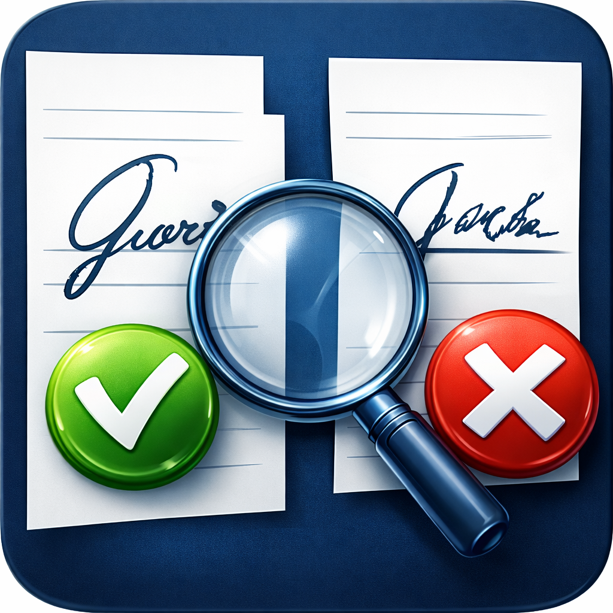

# NeuroSignature

<div align="center">



**Профессиональный анализатор подписей на соответствие оригиналу**

[](https://)
[](https://)
[](LICENSE)
[](https://)

*Искусственный интеллект для верификации рукописных подписей*

</div>

## 📋 О проекте

**NeuroSignature** — это десктопное приложение для автоматизированной проверки подлинности рукописных подписей. Программа использует алгоритмы компьютерного зрения и машинного обучения для сравнения проверяемой подписи с эталонным образцом и определения вероятности совпадения.

### 🎯 Ключевые возможности

- ✅ **Многофакторный анализ** — оценка по 120+ параметрам подписи
- ✅ **Точное сравнение** — расчет процентного соответствия с эталоном
- ✅ **Детектор подделок** — выявление обводки, копирования, имитации
- ✅ **Экспертные отчеты** — генерация заключений в PDF/DOCX
- ✅ **Пакетная обработка** — одновременная проверка множества документов
- ✅ **Локальная работа** — все данные обрабатываются на вашем компьютере

## 📸 Скриншоты

<div align="center">

| Сравнение подписей | Детальный отчет |
|:---:|:---:|
|  |  |
| **Анализ параметров** | **Статистика проверок** |
|  |  |

</div>

## 🚀 Быстрый старт

### Предварительные требования

- **ОС:** Windows 10/11 (64-bit) или Linux с Python 3.10+
- **ОЗУ:** 4 ГБ минимум (8 ГБ рекомендовано)
- **Место на диске:** 2 ГБ
- **Python 3.10+** (если запускаете из исходников)

### Установка из готового дистрибутива (рекомендуется)

1. **Скачайте последнюю версию** из [раздела Releases](https://github.com/ваш-username/SigMatch-Pro/releases)
2. **Запустите установщик:**
   - `SigMatchPro_Setup_1.0.0.exe` — для Windows с установкой
   - `SigMatchPro_Portable_1.0.0.zip` — портативная версия
3. **Следуйте инструкциям** мастера установки

### Запуск из исходного кода

```bash
# 1. Клонируйте репозиторий
git clone https://github.com/ваш-username/SigMatch-Pro.git
cd SigMatch-Pro

# 2. Создайте виртуальное окружение (рекомендуется)
python -m venv venv
venv\Scripts\activate  # Windows
# source venv/bin/activate  # Linux/Mac

# 3. Установите зависимости
pip install -r requirements.txt

# 4. Запустите приложение
python src/main.py
